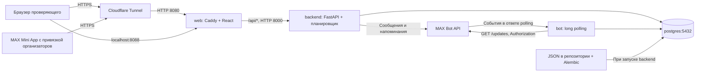

# Капля


Бот и мини-приложение MAX для доноров крови, решение кейса «Забота о людях».
Пользователь изучает правила донорства, выбирает центр и дату, оформляет демозапись,
получает напоминания и после донации формирует заявление на день отдыха.
Запись в реальные учреждения и медицинские системы не выполняется.

## Быстрый запуск для проверяющих

1. Установите Docker с Compose v2.24.4+, откройте терминал в корне репозитория.
2. Скопируйте `.env.example` в `.env`: `cp .env.example .env` (PowerShell: `Copy-Item .env.example .env`).
3. Впишите **только свой** `MAX_BOT_TOKEN`; остальные параметры уже подходят для проверки.
4. Выполните `docker compose --profile tunnel up --build`; дождитесь готовности backend и web.
5. Во втором терминале: `sh scripts/tunnel-url.sh` или `powershell -File scripts/tunnel-url.ps1`.
6. Откройте полученный HTTPS-адрес в браузере; локальный адрес — http://localhost:8088.
7. URL в `.env` менять и web перезапускать не требуется: привязку мини-приложения в MAX выполняют организаторы.
8. Username своего бота смотрите в логах `bot` или получите через `GET https://platform-api2.max.ru/me`, заголовок `Authorization: <токен>`.
9. Найдите `https://max.ru/<username>` и пройдите сценарий проверки ниже.

## Состав и архитектура

| Сервис | Роль |
|---|---|
| `postgres` | PostgreSQL 17.6, профили, центры, слоты, записи, история донаций |
| `backend` | Python 3.13, FastAPI, SQLAlchemy; миграции Alembic и импорт при старте; APScheduler для напоминаний |
| `bot` | Тот же Python-образ, отдельный процесс long polling MAX, существующие обработчики сообщений и callback |
| `web` | React/Vite, собранная статика; Caddy раздаёт SPA и проксирует `/api/*` в backend |
| `tunnel` | Необязательный Cloudflare Quick Tunnel, профиль `tunnel`, HTTPS без аккаунта |

Кэша, отдельного брокера очередей и внешнего DATA API нет. Контракт API:
[OpenAPI YAML](docs/openapi.yaml), [OpenAPI JSON](docs/openapi.json), актуальная схема
запущенного приложения — `/api/openapi.json`, Swagger — `/api/docs`.
Файл `DATA-API.yaml` в репозитории отсутствует. `legacy/russia-map` — исходные
данные и прежний прототип карты; отдельно запускать его не нужно.



## Запуск и зависимости

Нужны Docker Engine/Desktop с Linux-контейнерами, Compose v2.24.4+ и интернет
для загрузки образов/зависимостей, MAX API, туннеля и тайлов карты. Отдельно
устанавливать Python, Node.js, PostgreSQL, uv или облачный аккаунт не требуется.
Ориентир для стенда — 2 CPU и 4 ГБ RAM, свободный порт 8088.
В проверке сборка заняла 4 мин 14 с, первый запуск с импортом — ещё 90 с;
полный первый старт занял около 5 мин 45 с без первоначальной загрузки образов.

После подготовки `.env` все локальные компоненты запускаются одной командой:

```bash
docker compose up --build
```

С публичным HTTPS-адресом:

```bash
docker compose --profile tunnel up --build
```

Для фонового запуска добавьте `-d`. Готовность: `docker compose ps` и
`curl -fsS http://localhost:8088/api/v1/health` → `{"status":"ok"}`.
Backend становится готов после миграций и импорта; бот и web ждут его healthcheck.
Ошибка токена останавливает процесс бота с русской подсказкой. Docker перезапускает
его согласно `unless-stopped`; остальные сервисы продолжают работать.
При необходимости остановить повторы: `docker compose stop bot`.
После исправления токена: `docker compose up -d --force-recreate backend bot`.

Python-зависимости полностью закреплены в `backend/uv.lock`, установка —
`uv sync --locked --no-dev`; установленные версии проекта совпадают с lock-файлом.
Node-зависимости закреплены в `frontend/package-lock.json`, сборка — `npm ci`.
Диапазоны в манифестах не обновляют lock-файлы при сборке. Dev-зависимости frontend
нужны только сборочному этапу; в конечном образе находятся Caddy и статика.

## Параметры окружения

Обязателен только `MAX_BOT_TOKEN`. `.env.example` содержит комментарии и пустые
плейсхолдеры секретов. Реальный `.env` не входит в Git и контексты Docker.
Не публикуйте вывод `docker compose config`: он может содержать секреты;
для проверки синтаксиса используйте `docker compose config --quiet`.

| Переменная | Обязательность / локальное значение | Назначение |
|---|---|---|
| `MAX_BOT_TOKEN` | **Да**, пустой плейсхолдер | Токен своего бота, передаётся заголовком Authorization |
| `MAX_BOT_USERNAME` | Нет, пусто | Имя без `@`; backend и bot определяют через GET `/me` |
| `MAX_API_BASE_URL` | Нет, `https://platform-api2.max.ru` | Базовый адрес API MAX |
| `MAX_MODE` | Нет, `polling` | Локально long polling; webhook требует отдельной настройки |
| `MAX_WEBHOOK_URL` | Нет, пусто | Адрес для скрипта регистрации webhook |
| `MAX_WEBHOOK_SECRET` | Нет для polling, пусто | Секрет webhook; задать для режима webhook |
| `INIT_DATA_TTL` | Нет, `86400` | Срок действия подписи MAX initData, секунды |
| `SSL_CERTS_DIR` | Нет, `/certs` | Дополнительные доверенные сертификаты из `certs/` |
| `WEBAPP_URL` | Нет, пусто | Совместимость со старой конфигурацией; сейчас не используется |
| `POSTGRES_HOST` | Нет, `postgres` | Имя сервиса БД |
| `POSTGRES_PORT` | Нет, `5432` | Внутренний порт БД |
| `POSTGRES_DB` | Нет, `kaplya` | Имя базы |
| `POSTGRES_USER` | Нет, `postgres` | Пользователь локальной базы |
| `POSTGRES_PASSWORD` | Нет локально, пусто | На сервере нужен собственный пароль |
| `POSTGRES_HOST_AUTH_METHOD` | Нет, `trust` в примере | Только изолированная локальная БД без опубликованного порта; production — `scram-sha-256` |
| `API_V1_PREFIX` | Нет, `/api/v1` | Префикс API; менять согласованно с frontend и Caddy |
| `AUTH_DEV_MODE` | Нет, `true` в примере | Вход вне MAX по `X-Dev-User-Id`; проверка с тестовыми данными |
| `DEMO_MODE` | Нет, `true` | Демодействия и сброс профиля |
| `DOMAIN` | Нет, `:8080` | Внутренний HTTP listener Caddy, оставить для туннеля |
| `WEB_HTTP_PORT` | Нет, `8088` | Локальный веб-порт, привязан к 127.0.0.1 |
| `WEB_HTTPS_PORT` | Нет, `443` | Используется только в серверной надстройке |
| `CORS_ORIGINS` | Нет, `http://localhost:8088` | Старая настройка без подключённого CORS middleware; фронт и API работают с одного origin |
| `VITE_API_BASE_URL` | Нет, `/api/v1` | Путь API, встраивается при сборке web |
| `VITE_USE_MOCKS` | Нет, `false` | По умолчанию настоящий локальный API, не MSW |
| `VITE_DEV_USER_ID` | Нет, `1` | Один тестовый профиль в обычном браузере; внутри MAX используется initData |
| `API_PROXY_TARGET` | Нет, `http://127.0.0.1:8000` | Только Vite dev server без Docker |
| `COMPOSE_FILE` | Нет, не задана | Для серверной надстройки; локально оставить незаданной |

Изменение `VITE_*` требует `docker compose up -d --build web`.
Изменение остальных настроек требует пересоздания соответствующего контейнера
через `docker compose up -d --force-recreate <сервис>`, а не `restart`.
Тестовый профиль браузера общий: не вводите реальные персональные данные.
Любой обладатель ссылки туннеля получает доступ к этому демостенду.

## Порты

| Доступ | Порт / адрес |
|---|---|
| Браузер на компьютере жюри | `http://localhost:8088` → web:8080 |
| Публичный доступ | Выданный HTTPS URL → tunnel → web:8080 |
| Только сеть Compose | backend:8000, postgres:5432, web:8081 (healthcheck) |
| Серверная надстройка | 80/TCP и 443/TCP+UDP → Caddy 8080/8443 |

Порты PostgreSQL и backend на хост не публикуются. База находится в отдельной
внутренней сети `database`, к которой подключены только backend, bot и postgres.

## Туннель и подключение мини-приложения MAX

[Cloudflare Quick Tunnel](https://developers.cloudflare.com/cloudflare-one/networks/connectors/cloudflare-tunnel/do-more-with-tunnels/trycloudflare/)
выдаёт временный адрес `https://*.trycloudflare.com`. Скрипты `scripts/tunnel-url.sh`
и `scripts/tunnel-url.ps1` извлекают последний выданный адрес из логов сервиса.
При пересоздании туннеля адрес может измениться. Если URL ещё нет, повторите
скрипт через несколько секунд и проверьте `docker compose logs tunnel`.

Альтернативы: `ngrok http 8088` (может потребоваться аккаунт) или
`npx localtunnel --port 8088`; если изменён `WEB_HTTP_PORT`, подставьте его.
Полученный HTTPS URL открывается напрямую в браузере и передаётся организаторам
для привязки в кабинете MAX. **Ни `PUBLIC_WEB_URL`, ни изменение `WEBAPP_URL`
не управляют кнопкой в этом решении.** Устанавливать URL в `.env` и перезапускать
web для смены туннеля не нужно: frontend обращается к относительному `/api/v1`.

Подключение мини-приложения к боту MAX выполняют организаторы хакатона.
Код использует кнопку [`open_app`](https://dev.max.ru/docs-api/use-cases/sending-messages/keyboard)
с username бота. С новым токеном polling и обработчики чата не зависят от туннеля,
но открытие мини-приложения требует привязки в MAX. Веб-часть проверяйте по HTTPS
ссылке отдельно, в обычном браузере. Отправка приветствия включает `open_app`:
если MAX отклоняет такую кнопку у непривязанного бота, приветствие также не будет
доставлено. Полностью независимый чат для такого аккаунта без проверки MAX
гарантировать нельзя; обработчики и тексты сценариев сохранены.

Браузерный пользователь `1` не является вашим MAX ID. Его записи доступны на
сайте, но сообщения о них не обязаны появляться в вашем чате. Полная проверка
уведомлений требует открывать приложение из привязанного бота с подписанным initData.

Имя бота автоматически появляется в логах. Вручную его возвращает
[`GET /me`](https://dev.max.ru/docs-api/methods/GET/me) на
`https://platform-api2.max.ru/me` с заголовком `Authorization: <ваш токен>`.
Не передавайте токен в URL и не публикуйте его в скриншотах.
Один токен должен обслуживаться одним polling-процессом; активная webhook-подписка
мешает polling. Не используйте токен уже работающего боевого бота для проверки.

## Данные и тестовый режим

При каждом старте backend выполняет `alembic upgrade head`, затем
`python -m app.seeds.seed`, после чего запускается API. JSON-справочники находятся
в `backend/app/seeds`: 89 регионов, 405 центров в 84 регионах. Данные и миграции
включены в образ, ручной импорт и доступ к сайтам источников при старте не нужны.
Подробности происхождения, лицензии и даты: [DATA_SOURCES.md](backend/app/seeds/DATA_SOURCES.md).
Это **статический снимок открытых данных, не живая интеграция**.

Сид обновляет регионы и центры без дубликатов; генерирует демонстрационные статусы
запасов крови и слоты на 60 дней. Повторный запуск сохраняет записи пользователей
и не дублирует слоты. Статусы запасов при запуске заново задаются из демогенератора.
PostgreSQL хранится в томе `postgres_data`; Caddy — в `caddy_data`/`caddy_config`.
Сформированные PDF/DOCX возвращаются пользователю из памяти, отдельное файловое
хранилище не требуется.

Первый вход создаёт демопрофиль. Используйте вымышленные данные; в кабинете пять раз нажмите на аватар, чтобы открыть
демоменю со сбросом профиля и имитацией завершения донации. Для полного очищения
именно этого локального стенда используйте команду удаления томов ниже.
`backend/scripts/build_centers.py` нужен только для обновления снимка разработчиком,
а не для запуска. Геоданные карты описаны в [data/SOURCES.md](data/SOURCES.md).

## Сценарий проверки

| Шаг | Действие | Ожидаемое поведение |
|---|---|---|
| 1 | Проверить `/api/v1/health` | HTTP 200, `{"status":"ok"}`; postgres/backend/web healthy |
| 2 | Найти своего бота и отправить `/start` | Приветствие «Капля» и кнопка открытия приложения; при отклонении `open_app` см. ограничение выше |
| 3 | Отправить произвольный текст | Подсказка открыть приложение, без самостоятельного диалога записи |
| 4 | Открыть туннель в браузере | Веб-приложение и тестовый профиль, реальный локальный API; в чате новых сообщений не ожидается |
| 5 | Пройти вводные экраны и согласие | Открывается главный экран; при повторном входе вводные экраны могут быть уже пройдены |
| 6 | Выбрать запись, вид донации, регион и центр | Список/карта центров из снимка, доступные даты из демослотов |
| 7 | Выбрать дату (для плазмы — время), проверить данные и подтвердить | Запись появляется на главном экране; при входе из привязанного MAX-бота приходит подтверждение в чат |
| 8 | В кабинете пять раз нажать на аватар, открыть демоменю и нажать «Засчитать донацию» | Обновляется история/прогресс, доступна форма заявления PDF/DOCX; доставка в чат требует настоящего MAX-пользователя |
| 9 | Отменить/сбросить демоданные и повторить | Можно повторно пройти сценарий; справочник центров не дублируется |

Уведомления по времени работают через APScheduler в backend. Для короткого показа
используйте существующие демодействия; не ожидайте напоминания за день/два немедленно.

## Внешние сервисы, ограничения и боевая версия

- Реальные интеграции: MAX Bot API и MAX Bridge (при запуске внутри MAX),
  Cloudflare/выбранный туннель, OpenFreeMap для тайлов карты. MAX требует доверенных
  сертификатов: публичные сертификаты из `certs/` монтируются только для чтения.
- Справочные адреса центров взяты из открыто доступных источников, но их отдельная
  открытая лицензия не установлена. Актуальность часов и координат не гарантируется.
- Запасы крови, расписание, занятость и донорская история моделируются; интеграции
  с МИС, Госуслугами, реестром доноров и работодателем отсутствуют.
- Для боевой версии нужны согласованные API учреждений, права на данные, настоящая
  авторизация, защита персональных данных, мониторинг и резервные копии. Отключить
  `AUTH_DEV_MODE`/`DEMO_MODE`, очистить `VITE_DEV_USER_ID`, пересобрать web и задать
  пароль новой БД. Прод-настройки описаны в [docs/DEPLOY.md](docs/DEPLOY.md).
- По [документации MAX](https://dev.max.ru/docs-api/methods/GET/updates), polling
  предназначен для разработки/проверки; для production требуется webhook.
  Локальный запуск по умолчанию использует polling и не требует входящего HTTPS.
- Нельзя одновременно запускать несколько backend с одним планировщиком/сидом
  или несколько polling-процессов с одним токеном. Масштабирование здесь не настроено.
- Quick Tunnel временный и зависит от внешней сети; при его недоступности доступен
  локальный сайт. Первичная загрузка образов и пакетов зависит от скорости сети.

## Остановка и повторный запуск

```bash
# Остановить вместе с туннелем, сохранив данные
docker compose --profile tunnel down
# Без туннеля достаточно docker compose down
# Повторный запуск: те же тома, миграции и импорт применятся автоматически
docker compose --profile tunnel up -d --build
# Удалить ВСЕ данные этого стенда, включая тестовые профили и записи
docker compose --profile tunnel down --volumes
```

Не удаляйте тома рабочего сервера. Старый compose монтировал PostgreSQL 17 в
`/var/lib/postgresql`, новая конфигурация использует `/var/lib/postgresql/data`.
Для обновления старого стенда сначала сделайте `pg_dump` и восстановите его в
новый том; автоматического переноса старого вложенного/анонимного тома здесь нет.

## Проверка разработчиком

Для тестов используйте отдельную PostgreSQL-базу, не рабочий стенд. В `backend`:
`uv sync --locked`, затем с параметрами тестовой БД `uv run --locked pytest -q`.
Frontend: `npm ci && npm run build`; отдельного тестового скрипта в package.json нет.
Результаты проверки этой подготовки находятся в [docs/LAUNCH_VERIFICATION.md](docs/LAUNCH_VERIFICATION.md).

[Техническое задание](docs/TZ.md) · [Разработка без Docker](DEV_MAX.md) ·
[Логотип](docs/brand/README.md)
